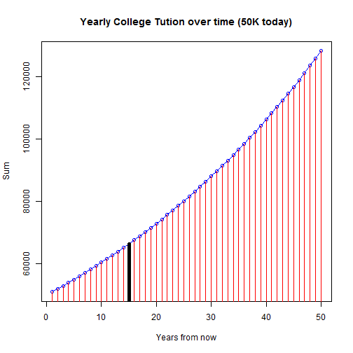

Can I afford an Ivy League education for my child?
========================================================
author: Stephane Nyombayire
font-family: 'Helvetica'
date: Wed Jul 2015

Why do this?
========================================================

College tuition has been steadily rising in the last few years. Ivy League schools which are the creme of the crop when it comes to College education have become pretty inaccessible financially to most families. 

The application aims to provide an easy way to gage affordability for such an education. This is a very simplistic approach and we only look at few key inputs: yearly tution increase rate (%), inflation and financial investments returns, as means to gain visibility to answer the question: Can I afford an Ivy League education for my child? 

App view
========================================================
left:75%
<small>Find the app at https://nyombs.shinyapps.io/CollegeAffordability </small>

***
<small>The app has 2 tabs:
- the Content tab where the calculations happen and 
- the Help tab where all the inputs and outputs are described.
</small>

Cost of College
========================================================
left: 30%

<small>For parents who have 50,000 dollars already saved up and plan to have a son go to college in 15 years </small>

***
<small>To have today's power of affording college, you need to have:  66,310 dollars if the college goes up at 1.9% annually </small>

 

Is Cost keeping up with your savings/investment?

========================================================

<small>With a return rate of 6% on your initial investment of 50K, your investment would be worth 75,881 dollars today if we chose inflation rate of 3%</small>
 
***
<small>With a return rate of 9% on your initial investment of 50K, your investment would be worth 115,330 dollars today if we chose inflation rate of 3%</small>
 

